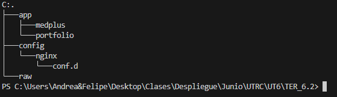
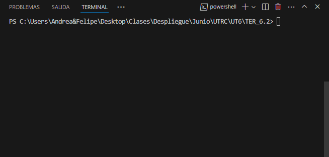
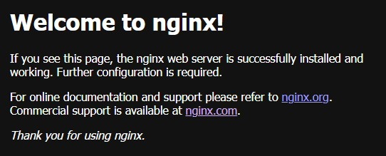
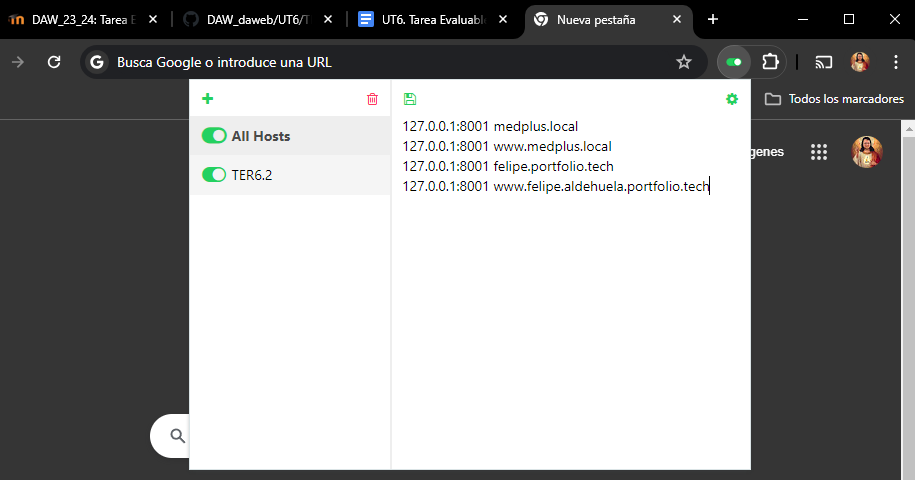
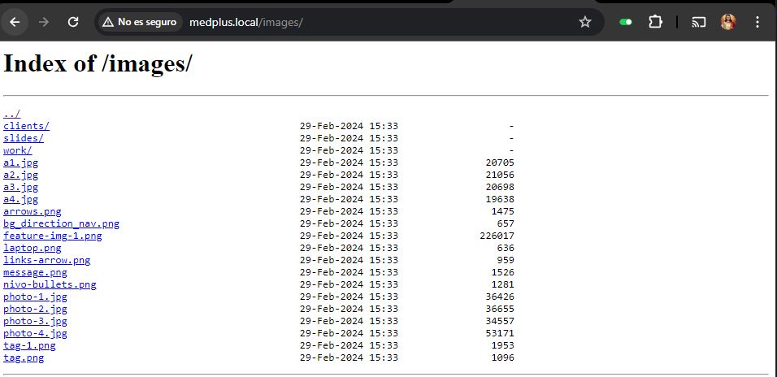
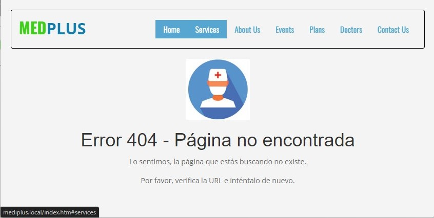
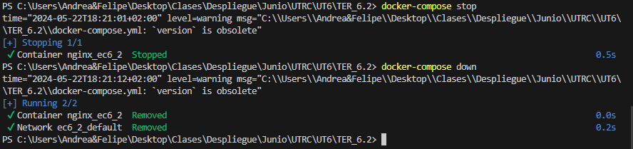
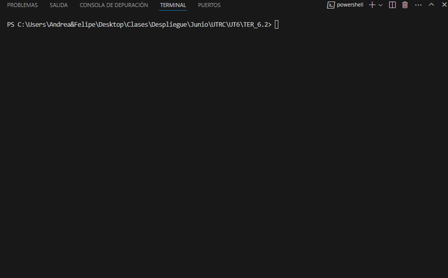
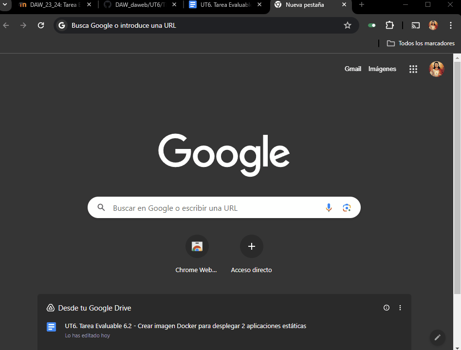
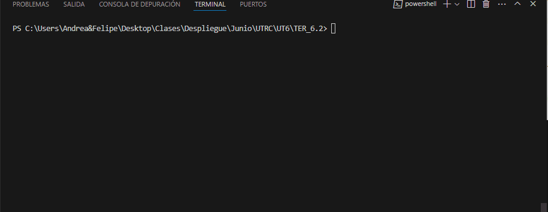

# UT6. Tarea Evaluable 6.2 - Crear imagen Docker para desplegar dos aplicaciones estáticas

- Hay que tener instalado Docker, Docker-compose y Visual Studio.
- Vamos a crear dos aplicaciones web en un mismo servicio.

### Paso 1. Preparación

Aquí vamos a crear la estructura de carpetas para añadir los archivos básicos necesarios para la tarea.



- En <strong>/TER6.2/</strong> crearemos el archivo <strong>docker-compose.yml</strong> para configurar los servicios y el archivo Dockerfile para construir la imagen.

- En <strong>/TER6.2/config/nginx/config.d/ </strong>crearemos los archivos de configuración para cada servidor: mediplus.conf para la aplicación mediplus y portfolio.conf para la aplicación portfolio.

- En <strong>/TER6.2/app/</strong> crearemos las carpetas mediplus y portfolio que contendrán los archivos de cada aplicación (HTML, imágenes, etc.). Los archivos se descomprimen desde mediplus y portfolio en sus respectivas carpetas.

### Paso 2. Archivos de configuración de servidor.

Como se mencionó antes, crearemos dos archivos de configuración independientes para cada aplicación, lo que resultará en dos servidores virtuales.

El archivo <strong>medplus.conf</strong> conf contendrá la configuración del servidor para la aplicación medplus.

El código es:
```bash
server {
    listen       80;
    server_name  medplus.local www.medplus.local;
    root   /var/www/html/medplus;
    index  index.html;
    error_page  404              /404.html;
    location /images {
        autoindex on;
    }
}
```

Cada línea es una directiva del servidor, separada por un ";". Detallamos cada una:

- listen: Escucha en el puerto especificado, en este caso el 80 de IPv4.

- server_name: Define los nombres de dominio del servidor, asignados como medplus.local y www.medplus.local.

- root: Declara el directorio raíz del servidor, que es /var/www/html/mediplus en el contenedor.

- index: Especifica la página principal por defecto. Aquí se usa index.html, y se buscan otras páginas en el orden definido si no se encuentra.

- error_page: Declara las páginas para errores específicos. Aquí, el error 404 (página no encontrada) está configurado para /404.html.

- location: Configura respuestas basadas en el URI de la solicitud. Para /images, la directiva autoindex lista todos los archivos en la carpeta /images.

El archivo <strong>portfolio.conf</strong> es el siguiente:

```bash
server {
    listen 80;
    server_name  felipe.portfolio.tech www.felipe.aldehuela.portfolio.tech;
    root   /var/www/html/portfolio;
    index  index.html;
    error_page 404 /404.html;
}
```

Como podemos ver ambos archivos son casi iguales, la diferencia es que no tiene la carpeta <strong>/images</strong>.

### Paso 3. Docker-compose

A continuación, probaremos que todo funciona correctamente. Para ello, crearemos un archivo
<strong>docker-compose.yml</strong>. para desarrollar nuestro servicio y verificar que todo funcione bien.

El código es:
```yml
version: '3.8'
name: ec6_2
services:
  web:
    image: nginx:1.25.3-alpine
    container_name: nginx_ec6_2
    ports:
      - 8001:80
    volumes:
      # App medplus
      - ./app/medplus:/var/www/html/medplus/
      # App portfolio
      - ./app/portfolio:/var/www/html/portfolio/
      # configuraciones servers
      - ./config/nginx/conf.d:/etc/nginx/conf.d
```

Vamos a explicar un poco el código:

- version: Especifica la versión del archivo Docker Compose.

- name: Asigna un nombre al proyecto.

- services: Declara los servicios necesarios. En este caso, solo declaramos un servicio, web.

- image: Especifica la imagen base a usar.
container_name: Define el nombre del contenedor que se creará.

- ports: Declara los puertos que se enlazarán entre el host y el contenedor.

- volumes: Especifica las carpetas que se enlazarán entre el host y el contenedor, incluyendo las carpetas de las aplicaciones y los archivos de configuración de los servidores.

Vamos a levantar el servicio con:

```bash
docker-compose up -d --build
```


Como ya tenemos el contenedor nos vamos al navegador e introducimos:

```
localhost:8001
```

Y veremos:



Aunque hemos configurado los servidores, no hemos especificado las rutas, por lo que Nginx muestra su página por defecto. Para acceder a nuestras páginas, debemos redirigir los dominios a la dirección IP correspondiente.

En Chrome, podemos usar la extensión Awesome Host Manager para redirigir automáticamente. Una vez instalada, abrimos la extensión y configuramos las redirecciones necesarias en la ventana que se muestra.



La redirección consiste en asignar la dirección IP, en este caso la del ordenador (o localhost) con el puerto, al dominio que queremos capturar y redirigir.

Con esto, configuramos el navegador para redirigir el dominio deseado a nuestra dirección IP local con el puerto especificado.

Nos vamos al navegador y ponemos:

```
medplus.local

o 

felipe.portfolio.tech
```

y obtenemos las diferentes páginas:


Vamos probar también el listado de imagen:

```
medplus.local/images
```



Vamos a hacer que tenga un fallo para que nos salga el error de página no encontrada:

```
mediplus.local/index.htm
```


Y lo mismo con la de portfolio:

```
felipe.portfolio.tech/index.htm
```


Ahora vamos a cerrar el docker-compose con:

```bash
# Paramos el servicio
docker-compose stop

# Paramos el servicio y borramos contenedores
docker-compose down
```



### Paso 4. Dockerizacion

Una vez comprobado que todo funciona correctamente, crearemos un <strong>Dockerfile</strong> para construir una imagen con todos los servicios y configuraciones. Aquí está el contenido del archivo:

```dockerfile
FROM nginx:1.25.3-alpine

COPY app/medplus /var/www/html/medplus/
COPY app/portfolio /var/www/html/portfolio/
COPY config/nginx/conf.d /etc/nginx/conf.d

EXPOSE 80

CMD [ "nginx", "-g", "daemon off;"]
```
Vamos a explicar el código:

- FROM: Define la imagen base que utilizaremos para construir nuestra imagen.

- COPY: Transfiere archivos desde nuestro sistema local al sistema de archivos del contenedor, incluyendo aplicaciones y configuraciones necesarias.

- EXPOSE: Abre puertos para permitir la comunicación con la imagen.

- CMD: Especifica el comando que se ejecutará al iniciar el contenedor; en este caso, se ejecuta nginx en primer plano para mantener el contenedor en funcionamiento.

Y construimos la imagen:

```
docker build -t  felipe/felipeaf_ter_6_2 .
``` 

Y construimos el contenedor:

```
docker run --name ter6_2 -p 8001:80 felipe/felipeaf_ter_6_2
```


Ahora vamos a probar que todo funciona como antes:


Ahora vamos a subir la imagen a <strong>DockerHub</strong>

Etiqueté mi imagen con mi nombre de usuario de Docker Hub:
```bash
docker tag felipe/felipeaf_ter_6_2 felipealdehuela91/felipeaf_ter_6_2
```

```bash
docker push felipealdehuela91/felipeaf_ter_6_2
```


Y comprobamos que está en nuestro repositorio [DockerHub](https://hub.docker.com/r/felipealdehuela91/felipeaf_ter_6_2) 